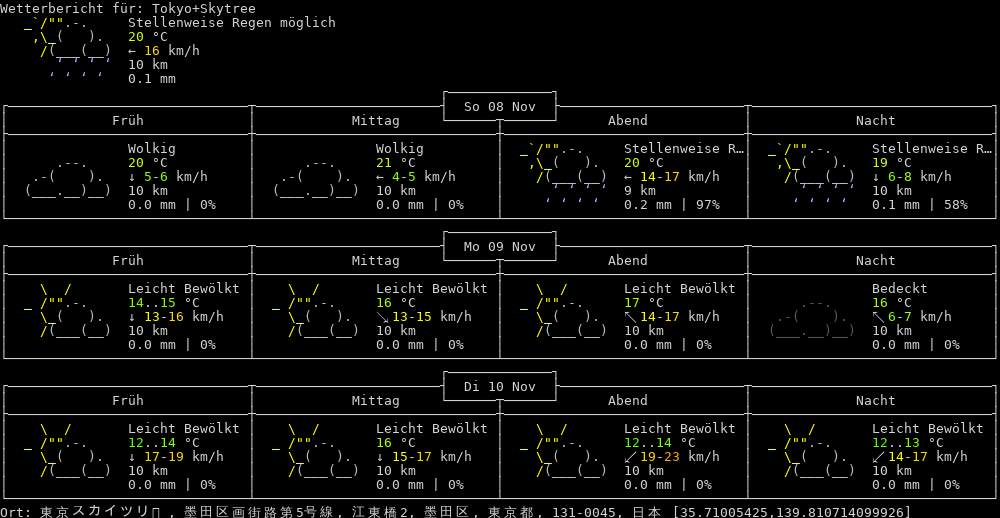

# tenki 天気

> 天気 (tenki), Japanese for _weather conditions_

tenki is a command-line client for [wttr.in](https://wttr.in/) written in Go, using the [Cobra](https://github.com/spf13/cobra) library.

## Usage Examples

```shell
$ ./tenki --help
Tenki is a CLI for querying weather information from wttr.in/ endpoints.

Users can define their location based on various query parameters including
location, nearest point-of-interest, nearest airport, or public domain name.

Supported location types:

    /paris                  # city name
    /~Eiffel+tower          # any location (+ for spaces)
    /Москва                 # Unicode name of any location in any language
    /muc                    # airport code (3 letters)
    /@stackoverflow.com     # domain name
    /94107                  # area codes
    /-78.46,106.79          # GPS coordinates

Usage:
  tenki [--language language] [--location location] [--path-to-png path/to/png] [--help]  [flags]

Flags:
  -h, --help                 help for tenki
      --language string      Language to generate output in (default "en")
      --location string      Query location
      --path-to-png string   Location to store PNG output
```

```shell
$ ./tenki --location Kyoto --language fr
Prévisions météo pour: Kyoto

     \  /       Partiellement couvert
   _ /"".-.     16 °C          
     \_(   ).   ↘ 19 km/h      
     /(___(__)  10 km          
                0.1 mm         
                                                       ┌─────────────┐                                                       
┌──────────────────────────────┬───────────────────────┤ dim. 08 nov.├───────────────────────┬──────────────────────────────┐
│             Matin            │          Après-midi   └──────┬──────┘       Soir            │             Nuit             │
├──────────────────────────────┼──────────────────────────────┼──────────────────────────────┼──────────────────────────────┤
│    \  /       Partiellement …│    \  /       Partiellement …│    \  /       Partiellement …│    \  /       Partiellement …│
│  _ /"".-.     17 °C          │  _ /"".-.     18 °C          │  _ /"".-.     12..14 °C      │  _ /"".-.     11..12 °C      │
│    \_(   ).   ↘ 12-14 km/h   │    \_(   ).   ↘ 16-18 km/h   │    \_(   ).   ↘ 16-21 km/h   │    \_(   ).   ↘ 10-13 km/h   │
│    /(___(__)  10 km          │    /(___(__)  10 km          │    /(___(__)  10 km          │    /(___(__)  10 km          │
│               0.0 mm | 0%    │               0.0 mm | 0%    │               0.0 mm | 0%    │               0.0 mm | 0%    │
└──────────────────────────────┴──────────────────────────────┴──────────────────────────────┴──────────────────────────────┘
                                                       ┌─────────────┐                                                       
┌──────────────────────────────┬───────────────────────┤ lun. 09 nov.├───────────────────────┬──────────────────────────────┐
│             Matin            │          Après-midi   └──────┬──────┘       Soir            │             Nuit             │
├──────────────────────────────┼──────────────────────────────┼──────────────────────────────┼──────────────────────────────┤
│    \  /       Partiellement …│  _`/"".-.     Pluies éparses │               Nuageux        │               Nuageux        │
│  _ /"".-.     10..11 °C      │   ,\_(   ).   11..13 °C      │      .--.     8..9 °C        │      .--.     8..9 °C        │
│    \_(   ).   → 13-14 km/h   │    /(___(__)  → 19-22 km/h   │   .-(    ).   ↘ 9-12 km/h    │   .-(    ).   → 7-9 km/h     │
│    /(___(__)  10 km          │      ‘ ‘ ‘ ‘  10 km          │  (___.__)__)  10 km          │  (___.__)__)  10 km          │
│               0.0 mm | 0%    │     ‘ ‘ ‘ ‘   0.1 mm | 73%   │               0.0 mm | 0%    │               0.0 mm | 0%    │
└──────────────────────────────┴──────────────────────────────┴──────────────────────────────┴──────────────────────────────┘
                                                       ┌─────────────┐                                                       
┌──────────────────────────────┬───────────────────────┤ mar. 10 nov.├───────────────────────┬──────────────────────────────┐
│             Matin            │          Après-midi   └──────┬──────┘       Soir            │             Nuit             │
├──────────────────────────────┼──────────────────────────────┼──────────────────────────────┼──────────────────────────────┤
│               Nuageux        │    \  /       Partiellement …│    \  /       Partiellement …│    \  /       Partiellement …│
│      .--.     10 °C          │  _ /"".-.     10..12 °C      │  _ /"".-.     7..9 °C        │  _ /"".-.     6..8 °C        │
│   .-(    ).   → 5-6 km/h     │    \_(   ).   → 11-13 km/h   │    \_(   ).   ↓ 13-17 km/h   │    \_(   ).   ↘ 11-16 km/h   │
│  (___.__)__)  10 km          │    /(___(__)  10 km          │    /(___(__)  10 km          │    /(___(__)  10 km          │
│               0.0 mm | 0%    │               0.0 mm | 0%    │               0.0 mm | 0%    │               0.0 mm | 0%    │
└──────────────────────────────┴──────────────────────────────┴──────────────────────────────┴──────────────────────────────┘
Emplacement: 京都市, 京都府, 日本 [35.0185804,135.763835]
```

tenki also lets you store colored output as PNG, using the `--path-to-png` flag. It can be combined with any language or location specification, e.g.

```shell
$ ./tenki --location ~Tokyo+Skytree --language de --path-to-png ./examples/TokyoSkytree.png
```

produces the following image:

